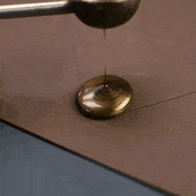

# 👋 Welcome

:blue\_book: This is the[ User-Manual ](https://open-info.gitbook.io/verified-app/)of the browser App, Verified.&#x20;

## Breakdown

How Verified Systems work.


[frontend-flow.md](user-interface/frontend-flow.md)



[verification.md](register-with-open-info/verification.md)



[flagging.md](register-with-open-info/flagging.md)


<figure><figcaption>
noice
</figcaption></figure>
