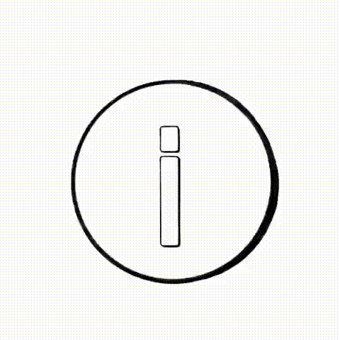

# 👋 Welcome

:blue\_book: This is the[ User-Manual ](https://open-info.gitbook.io/verified-app/)of the browser dApp, Verified.

## Start here


[1.-verified](pages/1.-verified/)


<figure><figcaption></figcaption></figure>

### How-Tos

How Verified Systems work.


[verification.md](oi-classifications/verification.md)



[flagging.md](oi-classifications/flagging.md)

