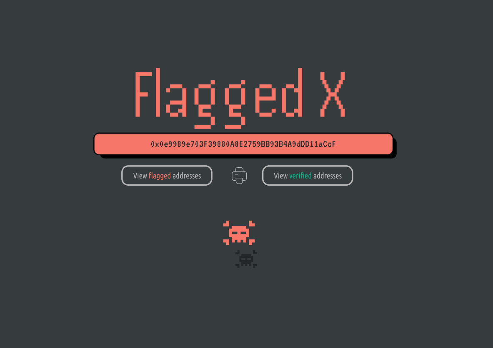

# ☠ Flagged !

<figure><figcaption>
PRINT: see the flagged <code>ERC 751</code>certificate of searched address.
</figcaption></figure>

## **FLAGGED:**

This account has been flagged by Open-Information for having acted or interacted with known malicious addresses.\
\
Click the printer icon to confirm the **Soulbound-NFT**.

## How to flag an existing address:


[flagging.md](../register-with-open-info/flagging.md)

