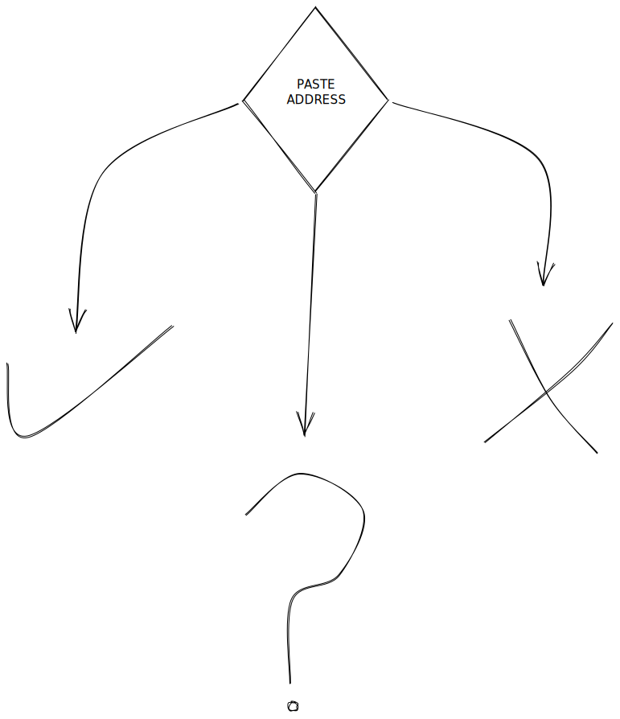

# 🔃 Frontend Flow


[1.-verified.md](1.-verified.md)


## **Search:**

After the user pastes an address, the following happens:\

1. A web3 call is made and the address metadata is returned.
2.  The results are shown as one of three things:

    ✔️ The address is verified\
    :exclamation: The address is flagged, or\
    :grey\_question: The address is unknown, optionally register it.


[verified.md](verified.md)



[flagged.md](flagged.md)



[unknown-greater-than-register.md](unknown-greater-than-register.md)


### **View all verified/flagged addresses:**

Display a list of verified or flagged addresses

### **Print `ERC1155` Soulbound NFT:**

Links the user to Flagged or Verified Soulbound NFT on EtherScan.
