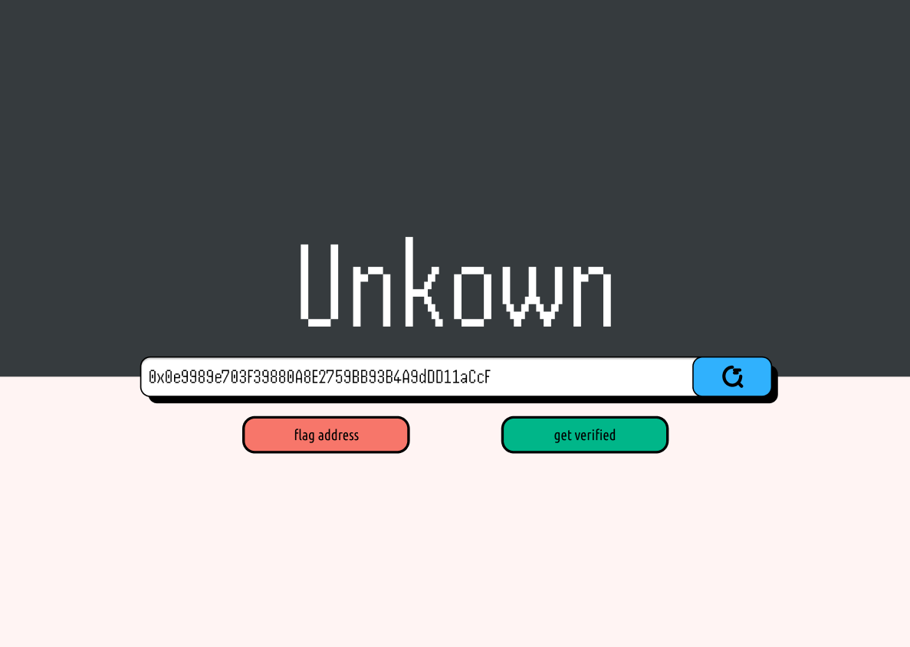

# 📝 Unknown -> Register

<figure><figcaption></figcaption></figure>

This address has not been verified or flagged by Open-Information yet.\
Here you can now either apply for verification or flag the address.

### Verification is a vetting process.


[verification.md](../register-with-open-info/verification.md)


### Flagging is manually reviewed.&#x20;


[flagging.md](../register-with-open-info/flagging.md)

